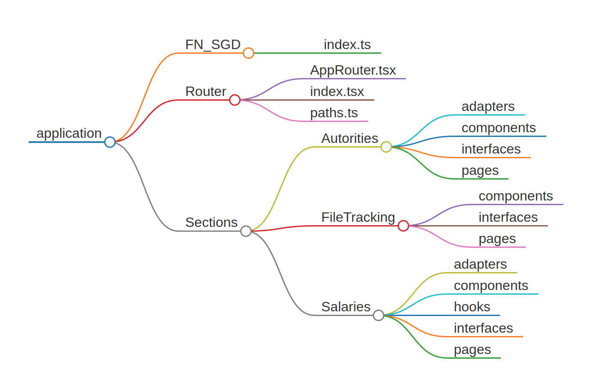

<h1 align="center">Institucional</h1>

<p align="center" width="300">
   
</p>
<br/><br/>

<p align="center">
  <a href="https://opensource.org/licenses/MIT" title="License: MIT">
    
  </a>
  <a href="https://img.shields.io/npm" title="npm">
    
  </a>
  <a href="https://www.npmjs.com/package/typescript)" title="npm version">
    
  </a>
</p>

<p align="center">
  Institucional de appsmagobar
</p>

<p align="center">    
  
</p>

<p align="center">
  <a href="http://staging.smandes.gov.ar/gitea/AppSma/tabla-de-versionamiento/src/branch/main/README.md#arquitectura-general">Documentación</a>
</p>

---

#### Arquitectura general

---

- Para mantener sincronía entre los módulos del proyecto se debe mantener actualizada la estructura de directorios.
- El desarrollo particular debe ocurrir dentro del directorio **application**.
- Dentro de /application hay dos directorios:
  - /Router: _Se define el enrutador y paths_
  - /Sections: _Desarrollo de las secciones el módulo_

<br/>

###### Estrutura

<p align="center">
  
</p>

---

#### Puesta en marcha

```sh
  $ pnpm run dev         #Iniciar en modo local
  $ pnpm run staging     #build en modo staging
  $ pnpm run production  #build en modo production
```

> > ---
> >
> > ### Directivas sysgetdata
>
> <br/>
>
> ---
>
> <br/>
>
> > **Autoridades - Sueldos - Expedientes**
> > | key | Función | Parametros |
> > | ---- | ------- | --------- |
> > | instittucional_Listar_Autoridades | fnappgetlistadoautoridades | |
> > | instittucional_Selector_Periodo_Sueldos | fnigrptsueldoswebcombo | |
> > | instittucional_Sueldos_Por_Periodo | fnigrptsueldosweb | liquidacion: string(periodo sueldo) |
> > | institucional_Expediente_Movimientos | fnexpmovimientos | expediente: string(00000-111/2023) |
>
> >
>
> <br/>

---

<br/>

#### Desarroladores

- [Esteban Menendez](https://github.com/ejmenendez)
- [Martín Nicolás Paneblanco](https://github.com/pmNiko)
