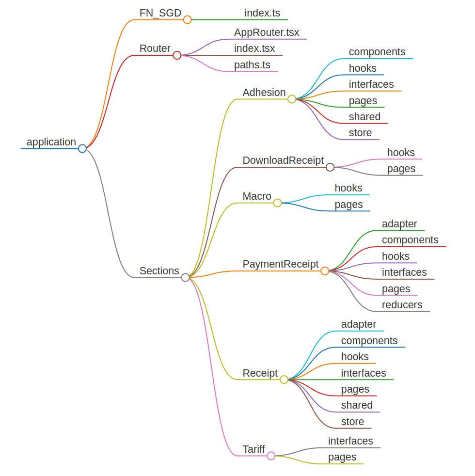

<h1 align="center">Rentas</h1>

<p align="center" width="300">
   
</p>
<br/><br/>

<p align="center">
  <a href="https://opensource.org/licenses/MIT" title="License: MIT">
    
  </a>
  <a href="https://img.shields.io/npm" title="npm">
    
  </a>
  <a href="https://www.npmjs.com/package/typescript)" title="npm version">
    
  </a>
</p>

<p align="center">
  Rentas de appsmagobar
</p>

<p align="center">    
  
</p>

<p align="center">
  <a href="http://staging.smandes.gov.ar/gitea/AppSma/tabla-de-versionamiento/src/branch/main/README.md#arquitectura-general">Documentación</a>
</p>

---

#### Arquitectura general

<p align="center">
  
</p>

- Para mantener sincronía entre los módulos del proyecto se debe mantener actualizada la estructura de directorios.
- El desarrollo particular debe ocurrir dentro del directorio **application**.
- Dentro de /application hay dos directorios:
  - /FN*SGD: \_Objeto de directivas para usequerysysgetdata*
  - /Router: _Se define el enrutador y paths_
  - /Sections: _Desarrollo de las secciones el módulo_

<br/>

###### Estrutura

<p align="center">
  
</p>

---

#### Puesta en marcha

```sh
  $ pnpm run dev         #Iniciar en modo local
  $ pnpm run staging     #build en modo staging
  $ pnpm run production  #build en modo production
```

<br/>

---

> > ---
> >
> > ### Directivas sysgetdata
>
> <br/>
>
> ---
>
> <br/>
>
> > **Validacion de tributos - Agrupador**
> > | key | Función | Parametros |
> > | ---- | ------- | --------- |
> > | Validar_Tributo | fnwsrecibosvalidartributo | cuitcuil: string <br/> tribu: string <br/> datoabuscar: string |
>
> >
>
> <br/>
>
> ---
>
> <br/>
>
> > **Listado Recibos - Detalle del tributo**
> > | key | Función | Parametros |
> > | ---- | ------- | --------- |
> > | Recibos_Listar | fnrcblistado | tribu: string <br/> n_serie: string <br/> anualsemestral: boolean <br/> target: string | number |
>
> >
>
> <br/>
>
> ---
>
> <br/>
>
> > **Comprobantes de pago**
> > | key | Función | Parametros |
> > | ---- | ------- | --------- |
> > | ComprobanteDePago_Selector_Tributos | fnrcblistadocomprobantesdepagocmbtributos | n_serie: number |
> > | ComprobanteDePago_Selector_Periodos | fnrcblistadocomprobantesdepagocmbanio | tribu\_\_n_serie: string |
> > | ComprobanteDePago_Listar | fnrcblistadocomprobantesdepago | n_cont: number <br/> ano: number <br/> tribu\_\_n_serie: string |
>
> >
>
> <br/>
>
> ---
>
> <br/>
>
> > **Adhesión de tributos**
> > | key | Función | Parametros |
> > | ---- | ------- | --------- |
> > | Adhesion_Listar | fnappgettributosxtribunserie | tribu: string <br/> n_serie: number |
> > | Adhesion_Solicitud | fntremailadhesionmasiva | email: string <br/> tributos: string(csv) |
> > | Adhesion_Confirmar | fntrconfirmaradhesionmasiva | md5: string |
> >
> > - tributos: el formato de envio es un csv **tribu-n_serie** separados por coma( , )
>
> >
>
> <br/>

---

> <br/>
>
> > **Tarifaria**
> > | key | Función | Parametros |
> > | ---- | ------- | --------- |
> > | Tarifaria_Valores_Puntos | fnvalvalorespuntos | |
>
> >
>
> <br/>

---

<br/>

> **Tarifaria**

| key | descripción                                                                                                             |
| :-- | :---------------------------------------------------------------------------------------------------------------------- |
| 01  | TASA S/INMUEBLE Y CONTR. TCI TASA POR SERVICIOS A LA PROPIEDAD INMUEBLE                                                 |
| 02  | COMERCIO COM TASA DE INSPECCION Y CONTROL DE SEGURIDAD E HIGIENEDE ACTIVIDADES COMERCIALES, INDUSTRIALES Y DE SERVICIOS |
| 03  | PATENTES PAT IMPUESTOS SOBRE LAS PATENTES DE AUTOMOTORES                                                                |
| 04  | TASA USO PLATAFORMA TUP DERECHO DE USO DE PLAYA DE ESTACIONAMIENTO DE LA ESTACION TERMINAL                              |
| 05  | VIVIENDAS VIV VAMEP -VIVIENDAS DE AYUDA MUTUA y ESFUERZO PROPIO                                                         |
| 06  | PRESTAMOS PRE PRESTAMOS                                                                                                 |
| 07  | ALQUILER LOCALES ALQ ALQUILER LOCALES TERMINAL DE OMNIBUS                                                               |
| 08  | LEGAL Y TECNICA LYT LEGAL Y TECNICA                                                                                     |
| 09  | PLAN DE FACILIDADES DE PAGO PFP PLAN DE FACILIDADES DE PAGO                                                             |
| 10  | MULTAS JUZGADO DE FALTAS MUL MULTAS JUZGADO DE FALTAS                                                                   |
| 11  | CEMENTERIO CEM DERECHOS DE CEMENTERIO                                                                                   |
| 12  | PLAN MORATORIA MOR PLAN MORATORIA                                                                                       |
| 13  | RENTAS VARIAS REN RENTAS VARIAS                                                                                         |
| 14  | PLAN DE PAGOS LEGALES LEG PLAN DE PAGOS LEGALES                                                                         |
| 15  | MORATORIA 2002/2003 MOR MORATORIA 2002/2003                                                                             |
| 16  | impuesto Inmobiliario INM Impuesto Inmobiliario                                                                         |
| 17  | FONDO ESP. EQUIPAMIENTO VIAL FEV FONDO ESPECIAL EQUIPAMIENTO VIAL                                                       |
| 18  | MEJORA TU CASA MTC MEJORA TU CASA                                                                                       |
| 99  | CONTRIBUYENTE CNT CONTRIBUYENTE                                                                                         |

---

<br/>

#### Desarroladores

- [Esteban Menendez](https://github.com/ejmenendez)
- [Martín Nicolás Paneblanco](https://github.com/pmNiko)
